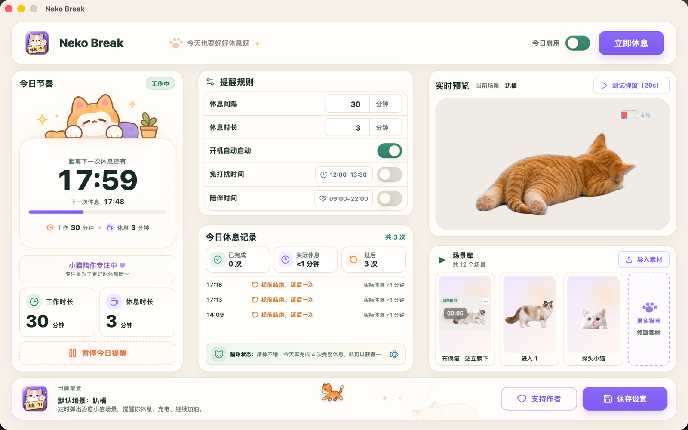
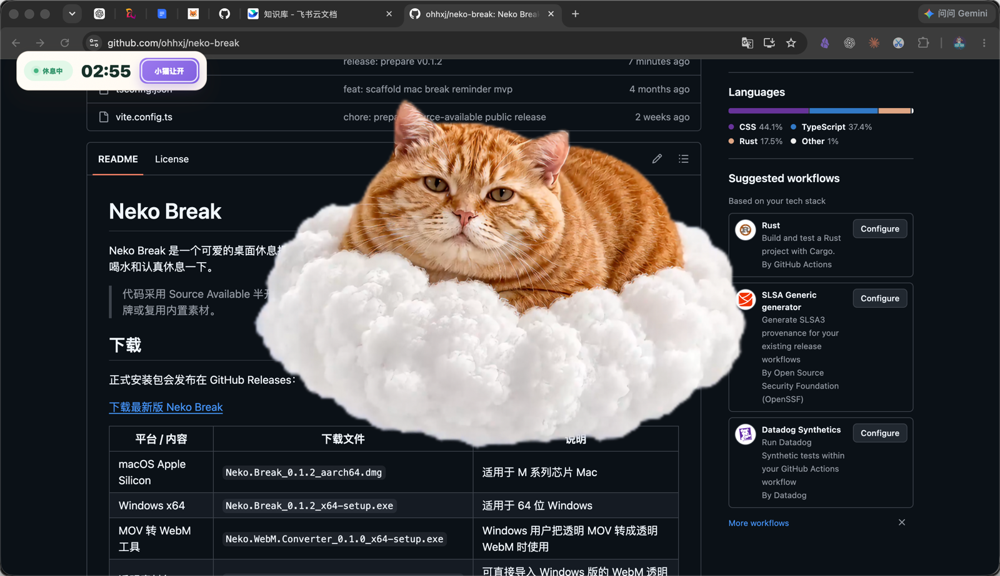
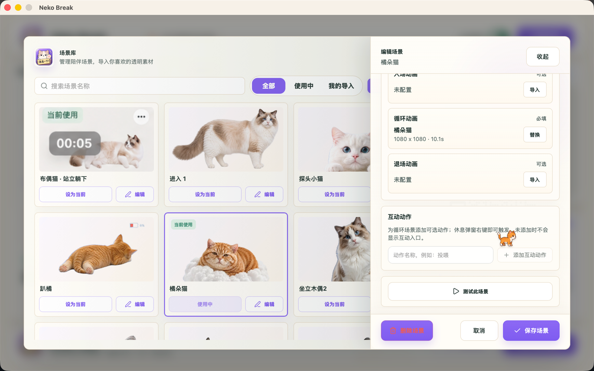
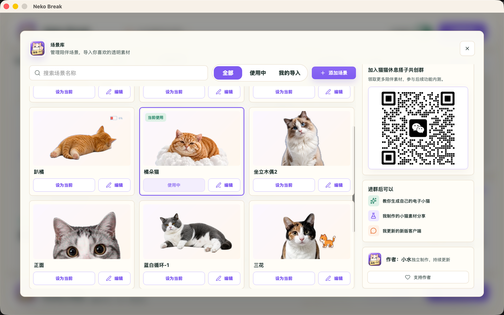
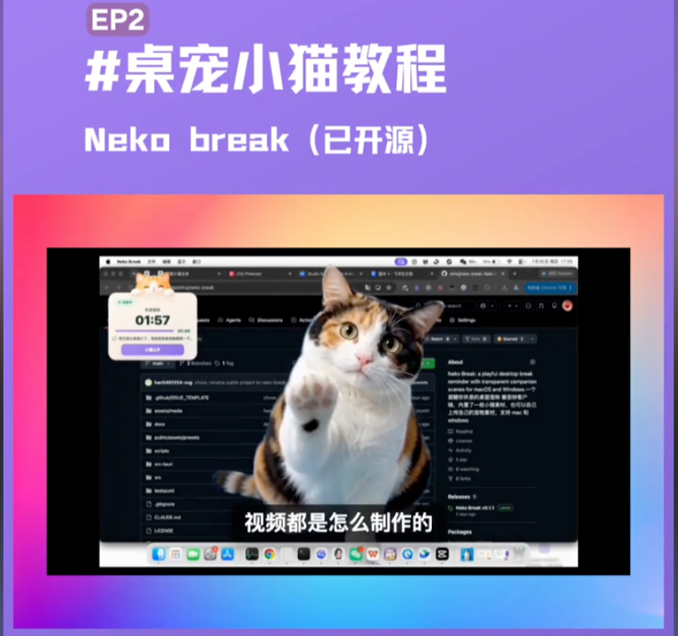
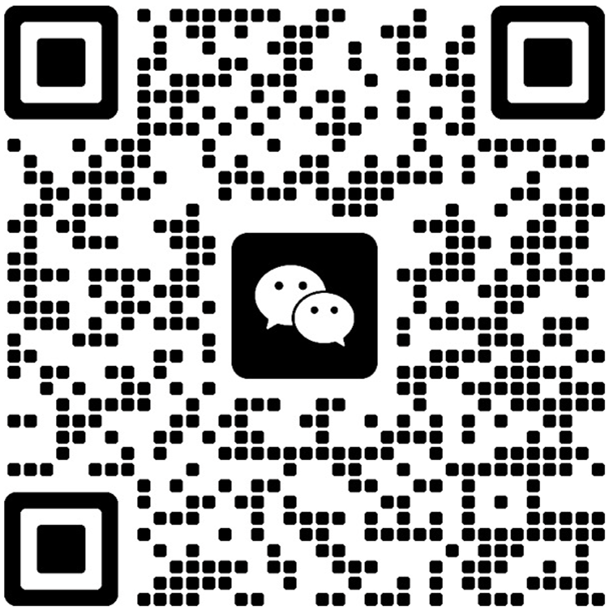

# Neko Break｜猫咪桌宠休息提醒

> 会提醒你休息的猫咪桌宠。

Neko Break 是一款支持 macOS 和 Windows 的桌面休息提醒工具。它会按你设置的节奏弹出透明猫咪素材，提醒你离开屏幕、活动肩颈、喝水和认真休息一下；你也可以导入自己的宠物素材，组合循环、入场、退场和互动动作。

> 代码采用 Source Available 半开源许可。你可以阅读、学习和提交反馈，但不能未经授权商用、二次分发、复刻品牌或复用内置素材。

<p align="center">
  
</p>

## v0.1.2 新功能

- 循环场景支持添加并命名多个互动动作，休息弹窗中右键即可触发
- 互动动作结束后自动回到默认循环，并通过预加载切换避免闪白和素材中断
- Windows 可以直接导入 MOV，由应用内置 FFmpeg 在后台转换，不再需要用户单独安装 FFmpeg
- 优化休息倒计时恢复逻辑，并修复托盘菜单更新可能导致的卡顿与崩溃

## 下载

正式安装包会发布在 GitHub Releases：

[下载最新版 Neko Break](https://github.com/ohhxj/neko-break/releases/latest)

| 平台 / 内容 | 下载文件 | 说明 |
| --- | --- | --- |
| macOS Apple Silicon | `Neko.Break_0.1.2_aarch64.dmg` | 适用于 M 系列芯片 Mac |
| Windows x64 | `Neko.Break_0.1.2_x64-setup.exe` | 适用于 64 位 Windows |
| MOV 转 WebM 工具（可选） | `Neko.WebM.Converter_0.1.0_x64-setup.exe` | 需要在应用外批量转换素材时使用 |
| 透明素材包 | `Neko.Break_Transparent_Cat_Assets_WebM.zip` | 可直接导入 Windows 版的 WebM 透明素材示例 |

当前安装包暂未做代码签名。macOS 首次打开时可能需要在系统设置中允许打开，Windows 可能会出现安全提示。

## 适合谁

- 长时间写代码、设计、剪辑、运营、写作的人
- 想要一个不冰冷的休息提醒工具的人
- 喜欢自定义桌面小猫、桌宠、透明视频素材的人

## 功能

- 固定间隔休息提醒
- 陪伴时间与免打扰时间
- 今日暂停与立即休息
- 休息记录、真实休息时长、提前结束/延后统计
- 透明素材休息弹窗
- 场景库、免费素材与自定义场景导入
- 循环、入场、退场和可命名互动动作
- 休息时右键选择互动动作，播放结束后自动恢复循环
- Mac 菜单栏 / Windows 托盘状态
- 支持作者与素材共创社群入口

## 产品体验

### 休息弹窗

休息时，小猫会以透明素材覆盖在当前桌面内容上。倒计时保留在易读但不打扰的位置；场景配置了互动动作时，可以右键选择动作。

<p align="center">
  
</p>

### 场景编辑

每个场景必须有循环动画，也可以继续添加入场、退场和多个自定义命名的互动动作。

<p align="center">
  
</p>

### 免费素材库

场景库集中管理内置素材、个人导入素材和当前使用的场景。更多免费素材、制作方法和新版内测会在共创群中更新。

<p align="center">
  
</p>

## 素材与导入

Neko Break 当前强调透明背景素材：

- macOS：推荐导入带 Alpha 通道的 `.mov`
- Windows：推荐导入带透明通道的 `.webm`
- 普通视频可以用于全屏休息场景，但不能产生桌面透明悬浮效果
- 一个场景由循环素材为核心组成，入场、退场和可命名互动动作可以后续补充

### 制作自己的宠物素材

想把自己的猫咪、狗狗或其他宠物做成桌面陪伴素材，可以跟着视频一步步制作：

<p align="center">
  <a href="https://www.douyin.com/video/7668679713916783914">
    
  </a>
</p>

**[在抖音观看教程：制作自己的桌宠素材](https://www.douyin.com/video/7668679713916783914)**

如果这份教程对你有帮助，欢迎在抖音给视频点个赞，也可以顺手收藏，方便制作素材时随时回来查看。你做出了自己的电子小宠物，也欢迎分享到共创群里。

如果你已经制作好了透明视频：

1. macOS 用户：直接在场景库里导入带 Alpha 通道的 MOV。
2. Windows 用户：可以直接导入 MOV，应用会在后台调用内置 FFmpeg 转换为透明 WebM；转换期间页面会显示处理状态。
3. 只想先试效果：下载 `Neko.Break_Transparent_Cat_Assets_WebM.zip`，解压后把里面的 WebM 导入 Windows 版。
4. 导入时优先上传循环素材；入场、退场和互动动作都是可选项，可以等主循环效果稳定后再补。

Windows 安装包已经内置 FFmpeg，不需要用户单独安装，也不会在转换时弹出命令行窗口。需要在应用外批量处理素材时，可以下载独立的 MOV 转 WebM 工具，或手动使用：

```bash
ffmpeg -i input.mov \
  -c:v libvpx-vp9 \
  -pix_fmt yuva420p \
  -auto-alt-ref 0 \
  -b:v 0 \
  -crf 24 \
  output.webm
```

## 免费素材与交流群

微信扫码加入「猫猫休息搭子共创群」，可以领取更多陪伴素材、交流电子小猫制作方法，并参与后续版本内测。

<p align="center">
  
</p>

为了方便长期维护，这里只公开交流群二维码，不公开作者个人微信。产品问题也可以直接通过 [GitHub Issues](https://github.com/ohhxj/neko-break/issues) 反馈。

## 本地开发

环境要求：

- Node.js
- Rust
- Tauri CLI
- macOS 构建 Windows 包时需要 `cargo-xwin` 和 `llvm-rc`

安装依赖：

```bash
npm install
```

运行开发环境：

```bash
npm run tauri:dev
```

构建 macOS：

```bash
npm run tauri:build
```

构建 Windows：

```bash
PATH="/opt/homebrew/opt/llvm/bin:$PATH" \
npm exec tauri -- build \
  --runner cargo-xwin \
  --config src-tauri/tauri.windows.conf.json \
  --target x86_64-pc-windows-msvc
```

测试：

```bash
npm test -- --run
```

## 半开源说明

这个仓库用于公开项目进展、安装包、问题反馈和部分源码。以下内容不代表可以自由复用：

- Neko Break 品牌、名称、图标和视觉风格
- 内置小猫素材、封面图、光标图、休息卡片图
- 社群二维码、赞赏二维码
- 打包产物、签名配置、未来商业化能力

如果你想基于 Neko Break 做二次开发、商用合作、素材合作或重新分发，请先联系作者。

## 反馈与路线

欢迎在 Issues 里提交：

- Bug 反馈
- Windows / macOS 兼容性问题
- 透明素材导入问题
- 休息逻辑建议
- 素材场景建议

路线和问题分级见 [项目管理说明](docs/project-management.md)。

## 作者

作者：小水

Neko Break 仍在快速迭代中，如果它真的让你多休息了一分钟，那它今天就算工作得不错。
